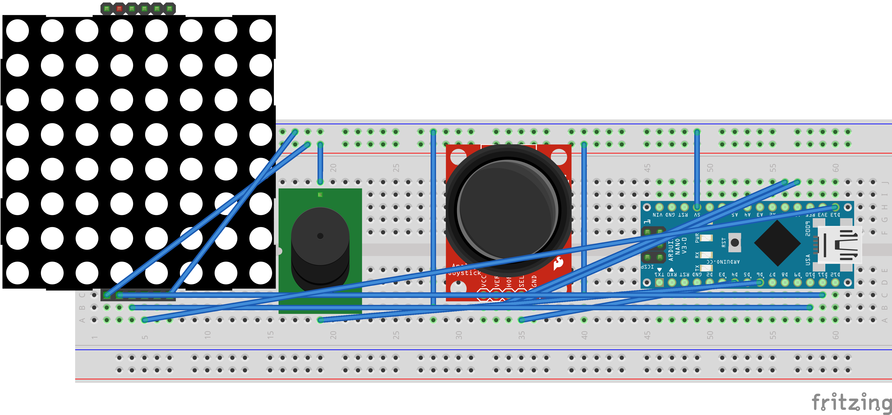

# 🐍 Arduino Nano Snake Game (8x8 LED Matrix + Joystick + Buzzer)

This is a simple implementation of the classic Snake game using an **Arduino Nano**, an **8x8 LED matrix with MAX7219**, a **joystick**, and a **buzzer** for sound effects.



---

## 🧩 Components Used

- Arduino Nano
- 8x8 LED Matrix (with MAX7219)
- Analog Joystick
- Passive Buzzer (or active)
- Breadboard + jumper wires
- USB cable for programming

---

## 🔌 Pin Connections

| Component     | Arduino Nano Pin     |
|---------------|-----------------------|
| Matrix DIN    | D11                   |
| Matrix CS     | D10                   |
| Matrix CLK    | D13                   |
| Matrix VCC    | 5V                    |
| Matrix GND    | GND                   |
| Joystick VRx  | A0                    |
| Joystick VRy  | A1                    |
| Joystick VCC  | 5V                    |
| Joystick GND  | GND                   |
| Joystick SW   | (Optional: D4)        |
| Buzzer +      | D3                    |
| Buzzer -      | GND                   |

---

## 🕹️ How to Play

- Tilt the joystick to change direction.
- Eat the blinking dot (food) to grow the snake.
- The game ends if the snake collides with itself.
- A buzzer plays tones for events like start, eating, and game over.

---

## 🚀 Getting Started

### 1. Clone the Repository

```bash
git clone https://github.com/your-username/arduino-snake-game.git
cd arduino-snake-game

